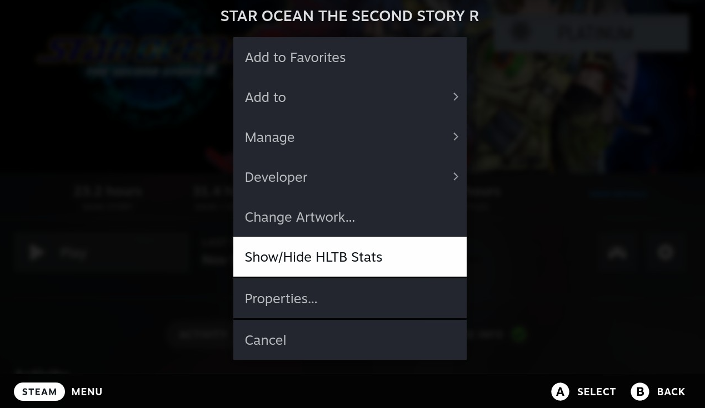
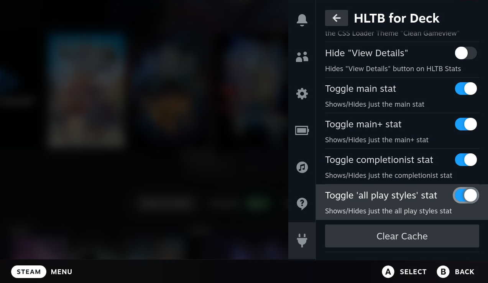

# HLTB for Deck

## Description

A plugin to show you game lengths according to How Long To Beat.

Built with [Decky Loader](https://github.com/SteamDeckHomebrew/decky-loader).

## Features

-   On an app page, shows four main stats offered by How Long to Beat
-   Clicking View Details will take you to their site for the game
-   Results are cached for two hours (cache can be cleared from QAM page for HLTB for Deck)

## Screenshots

## New Features (as of 1.4.0)

### Customize visbility of plugin per game

On the game's page, click the gear icon and then Show/Hide HLTB Stats to toggle whether or not the plugin is displayed for the current game. This allows you to customize whether you want to see the stats for a game or not.

### Customize which stats are displayed

From the Quick Access Menu HLTB For Deck settings page, toggle each stat individually.
